# Live Activity and Apple Watch simulator renders

These snapshots are generated from the app's current SwiftUI preview fixtures and Watch round fixtures.

## Live Activity

### Score-first matchup — light

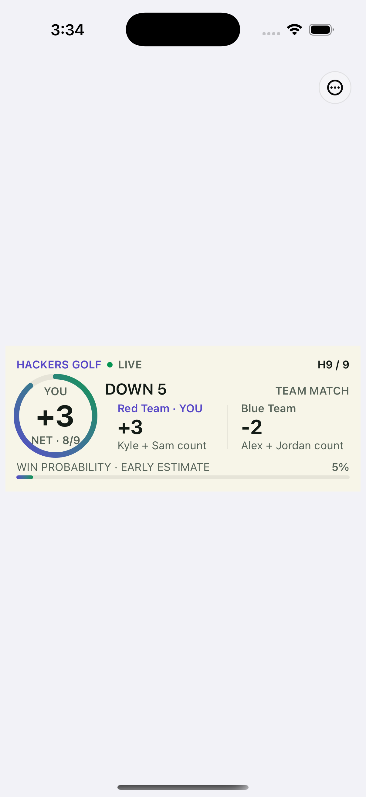

### Score-first matchup — dark

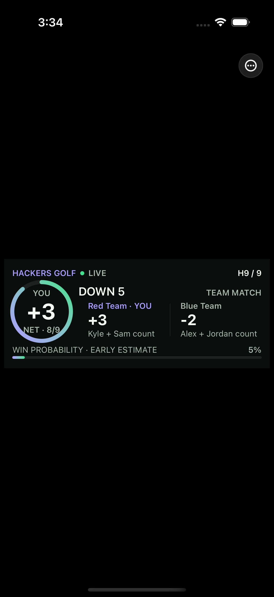

### Score-first team competition

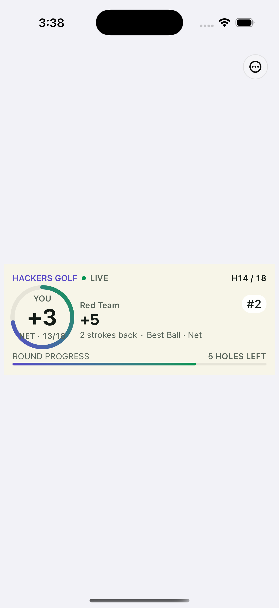

### Score-first individual competition

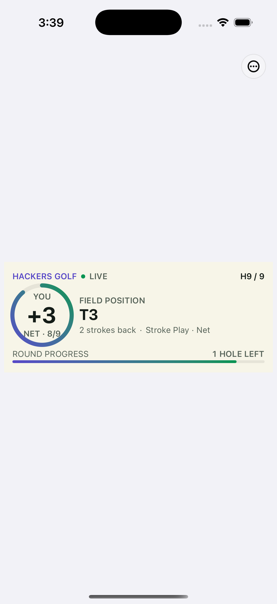

### Redesigned matchup — light

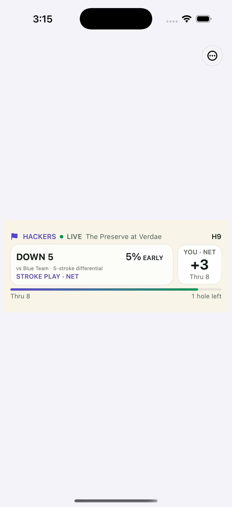

### Redesigned matchup — dark

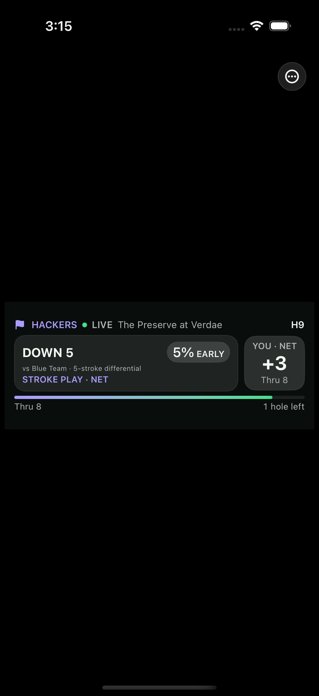

### Redesigned team competition

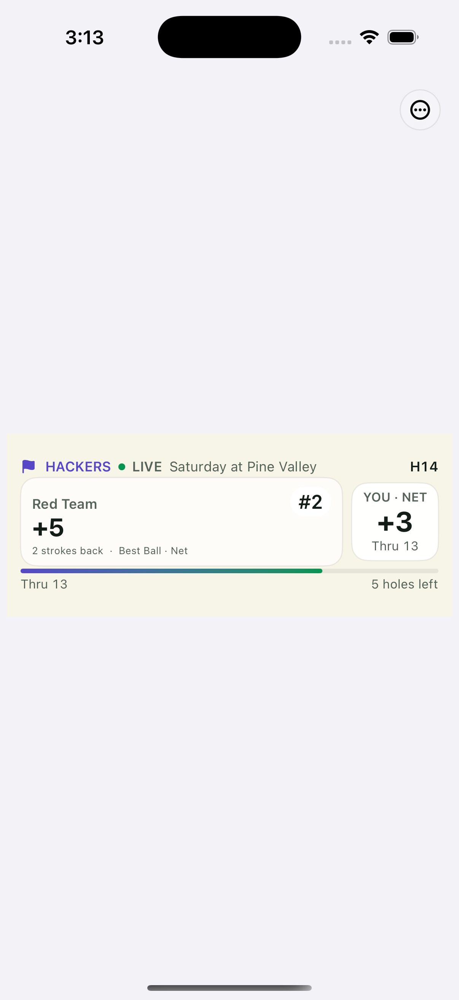

### Redesigned individual competition

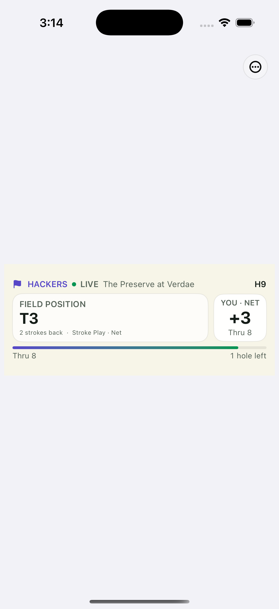

## Previous baseline

### Matchup

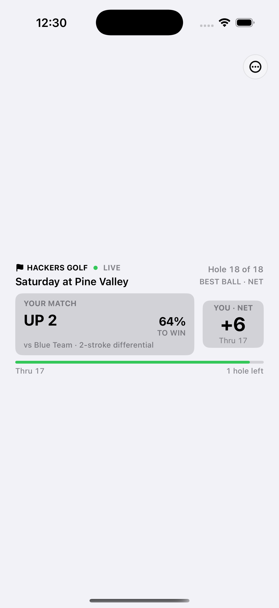

### Team competition

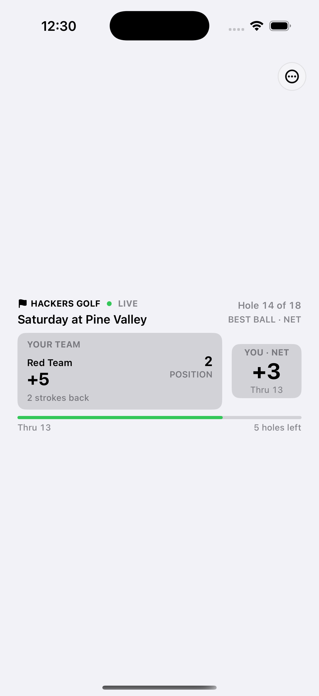

### Individual field position

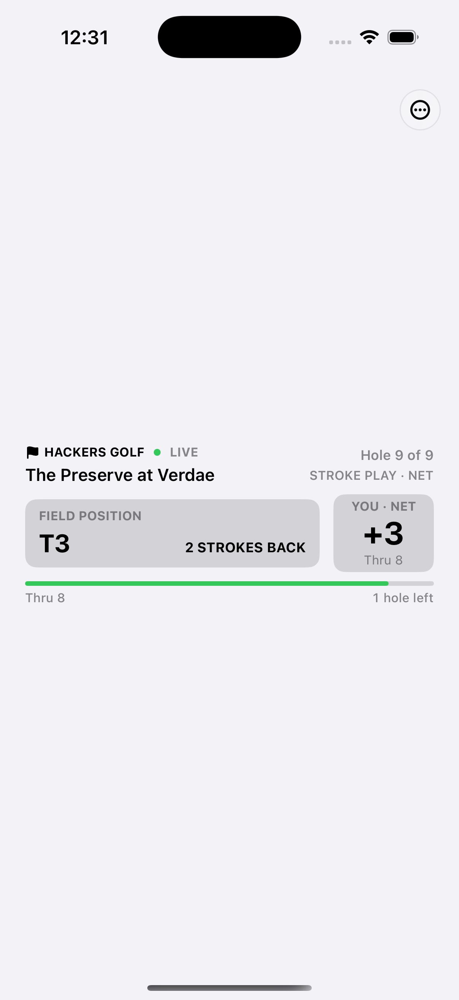

### Stale state

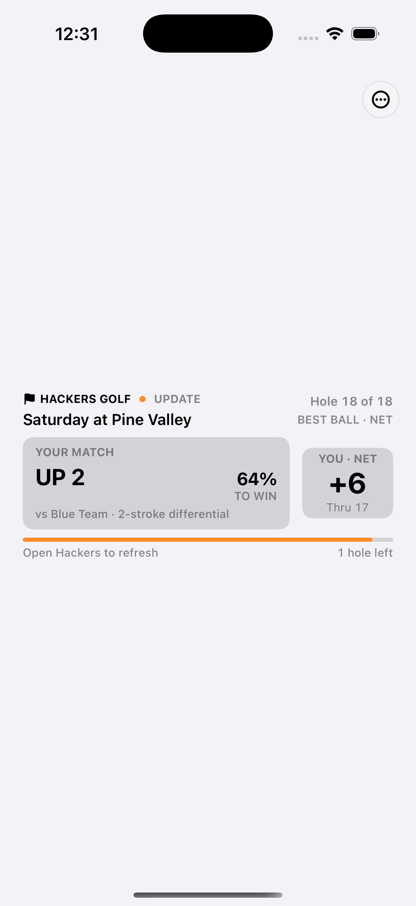

## Apple Watch

### Round scoring

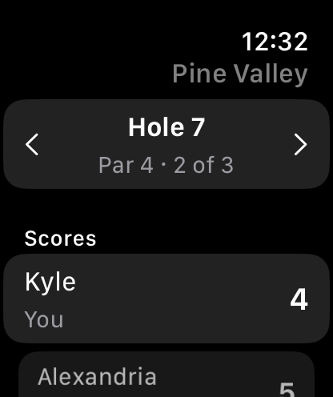

### Competition summary inside scoring

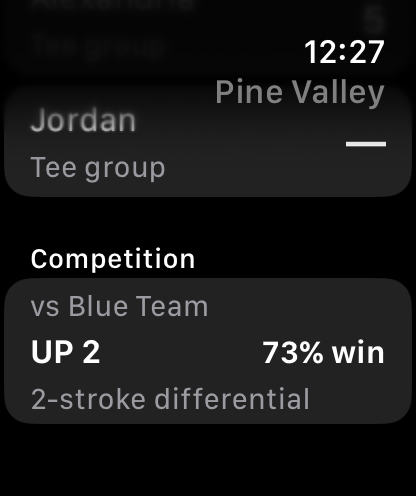

### Matchup leaderboard

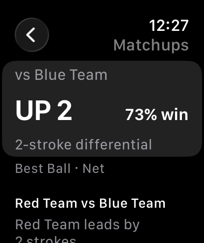

### Field leaderboard

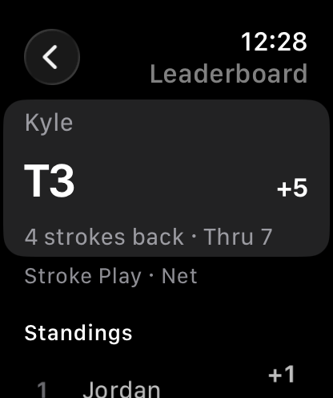
