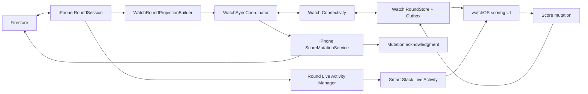

# Apple Watch Tee-Group Scoring MVP

Date: 2026-08-15

## Recommendation

Build this as a paired-companion MVP with two coordinated surfaces:

1. A focused watchOS app for per-hole score entry and correction for the user's actual tee group.
2. An iPhone Live Activity that starts when the user enters an active round. On iOS 18 and watchOS 11, the Live Activity automatically presents at the top of the Apple Watch Smart Stack; tapping it opens the watchOS app when installed.

Do not attempt to force-launch the watchOS app. Apple does not expose a general-purpose API for an iPhone app to foreground its Watch companion. The available `HKHealthStore.startWatchApp` API is specifically for starting a real workout session and is not appropriate for a scoring-only feature.

Do not put Firebase in the Watch target for the MVP. Firebase describes watchOS support as community-supported, and Firestore offline persistence is unavailable on watchOS. Use the signed-in iPhone app as the authenticated sync and write authority through Watch Connectivity.

### Difficulty and estimate

| Scope | Difficulty | One-engineer estimate | Result |
| --- | ---: | ---: | --- |
| Interaction prototype | 4/10 | 4-6 days | Static/mock scoring flow on Simulator; no reliable sync |
| Shippable paired MVP | 7/10 | 15-20 engineering days | Tee-group scoring, corrections, hole navigation, queued sync, Live Activity discovery, physical-device QA |
| Independent Watch product | 9/10 | 4-8 additional weeks | Direct backend access without the paired phone, independent auth, server API, stronger conflict handling |

The UI is straightforward. The schedule is driven by reliable cross-device synchronization, extracting score writes from `LiveRoundViewModel`, lifecycle handling, and physical iPhone/Watch testing.

## Evidence and product read

### Repository findings

- There is no Watch app or Widget Extension target today; the Xcode project contains only the iOS app and unit tests.
- The current app targets iOS 18.6, so iOS 18/watchOS 11 Live Activity behavior can be the baseline for the discovery experience.
- `RoundSession` already owns real-time round, participant, tee-group, segment, and score snapshots.
- `LiveRoundViewModel` already resolves the user's actual tee group, play-order hole sequence, next incomplete hole, individual/shared scoring units, score input mode, edit permissions, optimistic score updates, and rollback behavior.
- `ScoreEntry` already has a deterministic document ID based on hole, segment, and scoring unit. That is a strong idempotency foundation.
- Score mutation logic currently lives inside `LiveRoundViewModel`; it needs to move behind a reusable service before Watch messages can safely call it.
- The repository does not contain the deployed Firestore rules source. Watch scoring must not ship until deployed rules are verified to enforce the same participant/round eligibility server-side.
- The existing `Documentation/live-round-live-activity-plan.md` already covers the broader iPhone Live Activity architecture. The Watch MVP should reuse that contract and add the `.small` supplemental activity family rather than starting a second activity system.

### Current Apple platform behavior

- Starting with iOS 18 and watchOS 11, an iPhone Live Activity automatically appears at the top of the paired Watch Smart Stack. Apple also says the Smart Stack can automatically present when the activity begins.
- If a watchOS companion exists, tapping the Live Activity on Apple Watch opens it. Without one, the system offers a path back to the iPhone app.
- Watch Connectivity supports immediate messages, latest-state application context, guaranteed queued user-info transfers, and background delivery. Apple requires physical devices for representative testing.
- watchOS apps are normally suspended after the user lowers their wrist. The MVP should persist drafts/outbox state and must not depend on remaining frontmost for the round.
- Apple recommends short, focused Watch interactions and system controls. A wheel-style Picker is the native fit for precise score selection with the Digital Crown.

### Lightweight user signal

Public golf-app discussions are anecdotal, not representative research, but the pattern is consistent enough to guide the MVP:

- Golfers value leaving the phone in a bag or cart and completing the full scoring task on the Watch.
- The loudest frustration is unreliable phone/Watch synchronization or a Watch app that still says “start a round” after the phone round has begun.
- Users ask for fewer taps and a reduced scoring-only experience; advanced stats and social features are secondary during play.
- Battery complaints often correlate with continuous GPS and shot tracking. This scoring-only MVP should avoid workout/GPS sessions and continuous sensor use.

Product implication: success depends more on immediate readiness, visible sync status, and recoverable offline edits than on adding leaderboard or GPS content.

## MVP product contract

### In scope

- The signed-in participant's actual tee group only.
- Individual gross-stroke score entry for every active participant in that tee group.
- Existing-score correction and explicit clearing.
- Hole-by-hole navigation in actual play order, including front/back nine and shotgun starts.
- Default to the next incomplete hole.
- Optimistic local updates with clear pending, synced, and failed states.
- Queue score changes when the phone is temporarily unreachable and reconcile when it returns.
- Automatic Smart Stack discovery through the iPhone Live Activity when the user enters a live round.
- Tap-through from the Smart Stack into the exact round and current/next incomplete hole in the Watch app.
- Empty, loading, paused, completed, unsupported-format, stale, and disconnected states.
- VoiceOver, Dynamic Type, reduced-luminance/Always-On legibility, and haptic confirmation.

### Explicitly out of scope

- GPS distances, maps, shot tracking, heart rate, HealthKit workouts, and fitness recording.
- Leaderboards, standings, matchups, odds, chat, weather, round setup, player management, or round completion.
- Alternate tee-group proxy scoring by hosts or commissioners.
- Putts, fairways, greens, penalties, clubs, and other per-hole statistics.
- Shared-score formats such as scramble/tee-group/team scoring in the first release.
- Direct Firestore/Firebase access from watchOS.
- Fully independent cellular Watch operation when the paired iPhone cannot receive queued Watch Connectivity transfers.
- Watch complications or a permanently pinned Smart Stack widget; the Live Activity is the MVP discovery surface.

### Eligibility gate

Show the scoring experience only when all conditions are true:

- The round is `.live`.
- The current user resolves to an active participant.
- The participant has an actual tee group.
- The round uses participant-owned individual scoring and a stroke-compatible input mode.
- The user can edit the actual tee group's scores under the same policy as the iPhone app.

For paused, completed, spectator, shared-score, or unsupported rounds, show a concise read-only explanation and an “Open on iPhone” action. This prevents the Watch MVP from writing an incorrect scoring-unit shape.

## Watch UX specification

Use standard watchOS hierarchy, typography, materials, button styles, navigation, and Picker behavior. Carry one restrained Hackers accent color for identity; do not transplant the iPhone glass-card layout onto the Watch.

### 1. No active round

- Title: `No live round`
- Body: `Start or open a live round on iPhone.`
- Optional button: `Open Hackers on iPhone`

Do not show stale round data as if it were active.

### 2. Hole screen

The hole screen is the root of the scoring experience.

- Navigation title: short course/round name when space permits.
- Header: `Hole 7` with `Par 4`; yardage is optional and should be omitted if it causes crowding.
- Previous and next hole buttons with accessible labels.
- Progress: `2 of 4 scored`.
- Native vertical list of tee-group players in tee order.
- Each player row shows display name and one of:
  - `—` for unscored
  - the gross score for synced
  - the score plus a subtle progress indicator for pending
  - an error icon and `Retry` state for failed
- Use a checkmark next to the hole title only when every eligible scoring unit has a canonical score.

The Digital Crown scrolls the player list. A tap on a row opens score entry.

### 3. Score entry

- Navigation title: compact player name.
- Context line: `Hole 7 · Par 4`.
- System wheel-style Picker, driven by the Digital Crown.
- For a new score, initialize the draft at par but do not save until confirmed.
- For a correction, initialize at the canonical existing score.
- Primary button: `Save Score` or `Update Score`.
- Secondary menu action: `Clear Score` when a score exists.
- On save: optimistic row update, success haptic, and move to the next unscored player on the same hole.
- When the last score is entered: success haptic, brief `Hole 7 complete` confirmation, then advance to the next incomplete hole.

Score changes must never be sent merely because the Crown moved. Confirmation is intentional and prevents accidental writes while scrolling.

### 4. Hole selection and correction

- Previous/next buttons provide the fastest adjacent navigation.
- Tapping the `Hole N` header opens a compact hole list in play order with scored/incomplete indicators.
- Past holes remain editable through the same player-row flow.
- If a score changed elsewhere after the Watch loaded it, do not silently overwrite it. Present the canonical value and ask the user to review the correction again.

### 5. Connectivity states

- `Saving…`: mutation is currently being handed to the iPhone.
- `Pending`: safely stored in the Watch outbox and waiting for the iPhone.
- `Synced`: acknowledged by the iPhone after the Firestore write succeeds.
- `Needs attention`: rejected, stale, unauthorized, round no longer live, or repeated delivery failure.

Do not use a generic spinner for the entire hole while one row is pending. Keep the rest of scoring usable.

## Discovery and “automatic opening” behavior

### Recommended behavior

When the iPhone enters a live round and resolves a real participant:

1. Start or reconcile the round's Live Activity.
2. Send the Watch's latest round projection through `updateApplicationContext`.
3. On watchOS 11+, the system automatically presents the Live Activity at the top of the Smart Stack.
4. The Smart Stack layout shows `Hole 7`, progress, and a single `Score` affordance or clear tap target.
5. Tapping opens `hackersgolf:///watch-round?round_id=…&hole=…` in the Watch app.

This is the closest supported equivalent to the Now Playing behavior. The system automatically surfaces the Smart Stack, but it does not force the full Watch app to the foreground.

### Guardrails

- Respect the user's global Live Activity setting and a future in-app `Live Round Activity` preference.
- Do not start an `HKWorkoutSession` simply to launch or keep the Watch app visible. A scoring-only feature is not a workout session.
- Do not send a notification every time a round opens. Reserve notifications for actionable exceptions, if added later.
- If the Watch app is not installed, the Live Activity remains useful and routes toward the iPhone experience.

## Technical architecture



### Target structure

Add:

1. `Hackers Watch App` target, watchOS 11 minimum.
2. An iOS Widget Extension for the existing Live Activity plan, with `.supplementalActivityFamilies([.small, .medium])` for a custom Watch Smart Stack layout.
3. A Foundation-only shared contract folder with target membership in iOS, Watch, and the Widget Extension where needed.

Do not link Firebase, Sentry, PostHog, Google Sign-In, maps, or the full iOS dependency graph into the Watch target.

### Shared projection contract

The Watch should receive a small, presentation-safe snapshot rather than `RoundSnapshot` or Firebase models.

```swift
struct WatchRoundProjection: Codable, Equatable, Sendable {
    var schemaVersion: Int
    var revision: Int64
    var roundID: String
    var roundTitle: String
    var phase: Phase
    var currentParticipantID: String
    var teeGroupID: String
    var playOrder: [Int]
    var suggestedHole: Int
    var holes: [WatchHole]
    var players: [WatchPlayer]
    var scores: [WatchScore]
    var capabilities: Capabilities
    var generatedAt: Date
}
```

Each `WatchScore` needs a stable identity, canonical value, `lastUpdatedAt`, and a revision token. Avoid sending full player, course, team, or scoring-engine objects.

### Mutation contract

```swift
struct WatchScoreMutation: Codable, Equatable, Sendable {
    var schemaVersion: Int
    var mutationID: UUID
    var deviceSequence: Int64
    var roundID: String
    var holeNumber: Int
    var participantID: String
    var operation: Operation       // setStrokes(Int) or clear
    var baseScoreRevision: String?
    var createdAt: Date
}
```

The Watch supplies user intent, not trusted Firestore fields. The iPhone resolves segment ID, scoring-unit ID, participant IDs, entry participant, eligibility, score bounds, and document ID from its authoritative snapshot.

The response includes `mutationID`, accepted/rejected status, canonical score, canonical revision, and a user-safe error category.

## Sync strategy

### iPhone to Watch

- On entering a live round, round snapshot changes, participant resolution changes, score acknowledgment, pause/completion, or sign-out: rebuild the projection.
- Use `updateApplicationContext` for the latest complete projection. It naturally supersedes older state and is suitable for recovery after missed deltas.
- While both apps are active, optionally use `sendMessage` for lower-latency projection/ack updates.
- Debounce score-batch projection updates by approximately 250-500 ms.
- Persist the last projection on Watch so reopening is immediate, but label it stale until refreshed.

### Watch to iPhone

1. Persist the mutation to the Watch outbox before attempting delivery.
2. Apply it optimistically to Watch UI and label the row pending.
3. If the iPhone is reachable, use `sendMessage` and process the reply.
4. If immediate delivery fails or is unavailable, enqueue `transferUserInfo`.
5. Deduplicate on `mutationID`; serialize mutations per score identity.
6. Remove an outbox item only after a positive acknowledgment from the iPhone.
7. Retain rejected items as `Needs attention` until the user reviews or discards them.

### iPhone score-write boundary

Extract the existing `setScore`, `setRelativeScore`, and `clearScore` persistence rules from `LiveRoundViewModel` into a reusable `ScoreMutationService` or `RoundScoreWriter`.

That service must:

- Fetch or use an authoritative snapshot for the requested round.
- Resolve the current signed-in participant and actual tee group.
- Enforce live status, active presence, actual-group membership, supported scoring mode, and score bounds.
- Build the deterministic `ScoreEntry` exactly once.
- Preserve existing optimistic/rollback semantics for the iPhone caller.
- Write Firestore, mark `firstScoredAt` if needed, and return the canonical entry.
- Emit existing scoring telemetry with `entry_method = apple_watch` from the iPhone, not the Watch.

### Conflict policy

- Watch mutations include the revision of the score the user edited.
- If the canonical revision still matches, apply the mutation.
- If the score changed elsewhere, reject the mutation as stale and return the canonical value.
- The Watch then shows `Score changed on another device` and requires an explicit second confirmation.
- Mutations from the same Watch are ordered by `deviceSequence`; duplicate IDs are idempotent.

This is safer than unqualified last-write-wins, especially when a queued Watch correction arrives after someone corrected the same score on iPhone.

### Expected limitation

If the paired iPhone cannot run or receive Watch Connectivity deliveries, the Watch can retain edits but cannot make them authoritative in Firestore. The UI must say `Pending — waiting for iPhone`, not `Synced`. Direct cloud sync is a later architecture, not an MVP shortcut.

## Delivery plan

### Phase 0 — Contract and device spike (1-2 days)

- Confirm watchOS 11 as the minimum.
- Add mock Foundation-only Watch projection and mutation types.
- Build static Watch previews for 41 mm, 45/46 mm, and Ultra sizes.
- Verify wheel Picker behavior, Dynamic Type, long names, and hole navigation.
- Add a minimal Watch Connectivity round trip on a physical paired iPhone/Watch.

Exit: a mock hole can be scored and corrected on physical Watch, and a typed mutation reaches the iPhone.

### Phase 1 — Reusable score-write boundary (2-3 days)

- Extract score persistence from `LiveRoundViewModel` into a reusable service.
- Keep the existing iPhone behavior and telemetry stable.
- Add eligibility, deterministic-entry, set, correction, clear, rollback, and stale-revision unit tests.
- Add `apple_watch` to `LiveRoundEntryMethod`.

Exit: iPhone tests prove the existing scoring UI and the future Watch receiver use one canonical write path.

### Phase 2 — Watch scoring UI (4-5 days)

- Add Watch app target and root state handling.
- Implement no-round, loading, hole list, player rows, score Picker, correction, clear, completion, paused/completed, unsupported, and error states.
- Persist the last projection, selected hole, drafts, and mutation outbox.
- Add accessibility labels, haptics, and preview fixtures.

Exit: the complete MVP flow works against mock projections without the iPhone UI open.

### Phase 3 — Paired sync and reconciliation (4-5 days)

- Add iPhone and Watch `WatchSyncCoordinator` implementations.
- Project authoritative `RoundSession` state to Watch.
- Implement immediate messages, queued fallback, acknowledgments, retry, deduplication, serialization, and conflict rejection.
- Refresh/fetch the authoritative round when handling a background Watch mutation.
- End/clear Watch state on completion, archive, sign-out, or active-round switch.

Exit: airplane mode/Bluetooth interruption tests preserve edits and converge to the canonical Firestore scores after reconnection.

### Phase 4 — Live Activity discovery (3-4 days)

- Reuse the existing Live Activity plan and add the Widget Extension if not already implemented.
- Add a custom `.small` activity-family Watch layout.
- Start/reconcile the Live Activity after live-round participant resolution.
- Add Watch and iPhone deep-link routing to the correct round/hole.
- Verify behavior with Watch app installed, not installed, Live Activities disabled, and activity manually dismissed.

Exit: entering a live round on iPhone automatically presents the activity in the paired Watch Smart Stack; one tap opens the correct Watch hole.

### Phase 5 — Field hardening (3-4 days)

- Run full 9-hole and 18-hole test rounds with two phones and a paired Watch.
- Test foreground, background, terminated, temporarily unreachable, low-power, and reconnection scenarios.
- Verify all supported Watch sizes, Always-On reduced luminance, VoiceOver, large text, and long names.
- Verify deployed Firestore rules before beta.
- Instrument discovery, Watch open, score attempt, immediate/queued delivery, acknowledgment latency, retry, conflict, and unsupported-round fallback.

Exit: no silent score loss, duplicate write, wrong-hole write, or unauthorized tee-group write in the release matrix.

## Acceptance criteria

### Core flow

- A participant enters a live round on iPhone and sees the Live Activity automatically surface in the paired Watch Smart Stack on supported OS versions.
- Tapping the activity opens the Watch app on the round's next incomplete hole.
- The Watch lists only active members of the participant's actual tee group in tee order.
- The user can set, update, and clear every player's score for a hole.
- Completing the group advances to the next incomplete hole; any prior hole remains correctable.

### Data integrity

- Every mutation is durably stored before the Watch claims it is pending.
- The Watch never claims `Synced` before iPhone acknowledgment after a successful Firestore write.
- Duplicate delivery of the same mutation is harmless.
- A stale correction never silently overwrites a newer canonical score.
- Unsupported/shared formats never produce individual `ScoreEntry` documents from Watch.
- Round completion, archive, sign-out, or round switching invalidates the old Watch scoring session.

### Performance targets

- Warm Watch launch to usable cached hole: under 1 second p50.
- Reachable Watch save to optimistic UI: under 100 ms.
- Reachable Watch save to canonical acknowledgment: under 2 seconds p95 on normal connectivity.
- iPhone score change to visible Watch projection: under 2 seconds p95 while reachable.
- Zero lost acknowledged mutations in the field beta.

## Risks and mitigations

| Risk | Impact | Mitigation |
| --- | --- | --- |
| Watch/phone sync feels unreliable | Feature loses trust immediately | Durable outbox, explicit per-row state, application-context recovery, physical interruption tests |
| Score writes remain coupled to iPhone UI | Divergent logic and regressions | Extract one canonical score-write service before connecting Watch |
| Queued correction overwrites newer data | Silent scoring error | Base revision, stale rejection, explicit re-confirmation |
| Shared scoring creates duplicate/wrong entries | Scoring corruption | Eligibility gate shared formats out of v1; add them only with contract tests |
| Smart Stack is mistaken for force-launch | Product expectation mismatch | Describe and test the actual system behavior; never promise full app auto-foregrounding |
| Live Activity becomes stale in background | Misleading discovery state | Reuse stale dates and push-update roadmap from the existing Live Activity plan |
| Firebase on watchOS increases size and instability | Build/runtime risk | No Firebase in Watch target; use iPhone auth and Watch Connectivity |
| Deployed Firestore rules are unknown | Unauthorized writes | Verify/export rule behavior before beta; do not rely on UI checks alone |
| Long-running GPS/workout drains battery | Poor 18-hole reliability | No GPS, sensors, or workout session in the scoring MVP |

## Follow-on expansion order

1. Shared scoring units and scramble/team formats.
2. A pinned Smart Stack widget/complication for persistent access outside a Live Activity.
3. Score summary and simple match status on Watch.
4. Putts/penalties and configurable stat entry.
5. Direct server API for independent cellular Watch use.
6. Optional, legitimate golf workout/GPS features only if fitness and distance tracking become actual product requirements.

## Sources

### Apple

- [Design Live Activities for Apple Watch](https://developer.apple.com/videos/play/wwdc2024/10098/)
- [Bring your Live Activity to Apple Watch](https://developer.apple.com/videos/play/wwdc2024/10068/)
- [ActivityKit](https://developer.apple.com/documentation/activitykit)
- [Displaying live data with Live Activities](https://developer.apple.com/documentation/activitykit/displaying-live-data-with-live-activities)
- [Human Interface Guidelines: Live Activities](https://developer.apple.com/design/human-interface-guidelines/live-activities)
- [Transferring data with Watch Connectivity](https://developer.apple.com/documentation/watchconnectivity/transferring-data-with-watch-connectivity)
- [Watch Connectivity](https://developer.apple.com/documentation/watchconnectivity)
- [Designing for watchOS](https://developer.apple.com/design/human-interface-guidelines/designing-for-watchos/)
- [Human Interface Guidelines: Digital Crown](https://developer.apple.com/design/human-interface-guidelines/digital-crown)
- [Human Interface Guidelines: Pickers](https://developer.apple.com/design/human-interface-guidelines/pickers)
- [`HKHealthStore.startWatchApp`](https://developer.apple.com/documentation/healthkit/hkhealthstore/startwatchapp%28with%3Acompletion%3A%29)

### Firebase

- [Firebase Apple-platform support matrix](https://firebase.google.com/docs/ios/learn-more)
- [Firestore offline persistence](https://firebase.google.com/docs/firestore/manage-data/enable-offline)

### Public UX signal

- [18Birdies App Store reviews](https://apps.apple.com/us/app/18birdies-golf-gps-tracker/id892700751?see-all=reviews)
- [Golf Watch synchronization discussion](https://www.reddit.com/r/golf/comments/13u6fq2)
- [Scoring-only Watch discussion](https://www.reddit.com/r/GolfSwing/comments/1sf7n5i)

