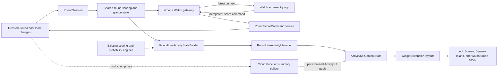

# Live Round Watch Scoring, Live Activity, and Dynamic Island Plan

Date: 2026-08-15

## Recommendation

Build the native Watch score-entry workflow first, then add the read-only Live Activity on top of the same shared state and score-command foundation.

1. Extract platform-neutral round scoring subjects, score commands, and glance state from `LiveRoundViewModel`.
2. Add an iPhone-selected active Watch round, a WatchConnectivity gateway, an offline mutation queue, and the focused watchOS scoring app.
3. Add the on-device Live Activity and custom Watch Smart Stack presentation using the same shared state.
4. Add ActivityKit push updates after the presentation contract is stable. This is a separate backend project because the current Firebase Functions code cannot reuse the Swift scoring and matchup-probability engines.

The focused Watch app is a medium-to-high complexity companion feature because score writes must be durable, idempotent, permission-checked, and safe when the phone is unreachable. The Live Activity becomes smaller once those boundaries exist. A production Live Activity that stays current while the app is suspended remains a high-complexity cross-stack feature.

| Scope | Difficulty | One-engineer estimate | Result |
| --- | --- | --- | --- |
| Shared scoring/sync foundation and focused Watch app | 7/10 | 12-20 engineering days | Select one round on iPhone; enter, review, and correct tee-group scores on Watch; offline-safe sync |
| On-device Live Activity after shared foundation | 4/10 | 3-5 engineering days | Accurate while the app is active or receives runtime; automatic Watch Smart Stack presence |
| Remote-update production release | 8/10 | 3-5 additional weeks | Personalized score, team score, hole, and matchup odds while the app is suspended |

These estimates include implementation, previews, unit tests, physical-device QA, and a small stabilization pass. They do not include App Store review time.

## Why the Feature Fits

A golf round has a clear start and end, usually lasts less than Apple's recommended eight-hour Live Activity window, and has a small set of glanceable changing values. It is a strong Live Activity use case.

The repository already provides most of the app-side inputs:

- `RoundSession` maintains realtime Firestore listeners for round, participant, team, tee-group, segment, and score changes.
- `LiveRoundViewModel` resolves the signed-in participant, the participant's team, format-aware gross/net scores, tee-group play order, and next unscored hole.
- Matchup rounds already precompute and invalidate `MatchupProbability` values as scores change.
- `RoundResumeState` already preserves an active round and selected hole.
- The app targets iOS 18, so ActivityKit availability does not require legacy fallbacks.

The missing foundations are a Widget Extension, ActivityKit configuration, a Live Activity lifecycle service, direct Live Activity deep-link routing, push notification capabilities, Activity push-token storage, and an APNs provider path.

For native Watch scoring, the repository also needs a Watch App target, a WatchConnectivity service on both devices, a portable score-entry contract, an iPhone active-round selector, and a durable score-mutation queue. Cloud Firestore is not an appropriate direct Watch dependency here: Firebase's watchOS support is community-supported and its current support table does not list Cloud Firestore for watchOS. The companion iPhone should remain the authenticated Firestore gateway.

## Native Watch App Product Contract

The Watch app has one job: enter and review hole scores for the wearer and the wearer's actual tee group.

It does not include a leaderboard, matchup odds, round setup, chat, maps, weather, player insights, presence management, round completion, or a Watch-side round picker.

### Active-round selection

- The iPhone app owns `watchRoundID`.
- Show only live or paused rounds the current user can score.
- If exactly one eligible live round exists and no prior selection exists, it may be selected automatically.
- If several are live, preserve the current valid selection or ask the user to choose `Active on Apple Watch` in the iPhone app.
- A round switch does not discard queued Watch edits because every mutation carries its own `roundID`.
- When no eligible live rounds exist, or the selection completes/archives, push an explicit empty state to the Watch.

### Watch information architecture

Use one `NavigationStack` and three payload-driven states:

1. `empty`: `No live round` plus `Choose a live round in Hackers on iPhone.`
2. `round`: the current hole and ordered editable scoring subjects.
3. `scoreEditor(subject, hole)`: a focused score picker with Save, Save & Next, and Clear when a score exists.

The round screen contains:

- Compact round/course title.
- Explicit previous and next hole buttons with `Hole 7 · Par 4` between them.
- One row per editable scoring subject in tee order.
- Current gross score or friendly relative-to-par label; unscored rows show an em dash.
- A subtle per-row pending, synced, conflict, or failed status.
- After every subject is scored, a clear `Next hole` action instead of forced auto-advance.

The iPhone prepares `WatchScoringSubject` rows. For ordinary rounds these map one-to-one to active tee-group participants. For shared-score formats they map to the canonical partnership/team/score-owner unit. The Watch must not reconstruct scoring-unit ownership or permissions.

### Score entry behavior

- Match the round's configured input mode: gross strokes or friendly relative-to-par.
- In the editor, use the Digital Crown/native picker to adjust the value.
- Default an unscored value to the hole's par (or `E`) visually, but do not persist until the user taps Save.
- `Save & Next` advances to the next unscored scoring subject on the same hole.
- Reviewing a prior hole uses the same screen; tapping an existing score edits it.
- Clear is explicit and never triggered by tapping the currently selected value.
- Use optimistic UI, but keep `Pending` visible until the iPhone gateway acknowledges the authoritative write.

### Connectivity and offline behavior

Use WatchConnectivity as two separate channels:

- `updateApplicationContext(_:)` sends the latest selected-round snapshot from iPhone to Watch. It is replaceable state; only the newest version matters.
- Score commands are durable events. Persist them locally on Watch before sending. Use an immediate message when reachable for low latency and a queued `transferUserInfo(_:)` fallback, with the same mutation ID so the iPhone can deduplicate both delivery paths.

The Watch remains usable when the phone is temporarily unreachable. Scores show as pending and sync when WatchConnectivity can deliver them. This is not independent cloud scoring: an LTE Watch without a reachable iPhone may queue edits rather than commit them immediately.

### Shared portable contracts

Keep the Watch target free of Firebase and app-only model imports. Use a small shared target or local Swift package containing only `Foundation`, Codable value types, and pure formatting/validation rules.

Suggested payloads:

```swift
struct WatchRoundSnapshot: Codable, Hashable, Sendable {
    var revision: Int
    var roundID: String
    var title: String
    var phase: RoundPhase
    var selectedHole: Int
    var holes: [WatchHole]
    var subjects: [WatchScoringSubject]
    var scores: [WatchScoreKey: WatchScoreValue]
    var acknowledgedMutationIDs: Set<UUID>
    var updatedAt: Date
}

struct WatchScoreMutation: Codable, Hashable, Sendable {
    var id: UUID
    var roundID: String
    var holeNumber: Int
    var scoringUnitID: String
    var participantIDs: [String]
    var operation: Operation
    var observedScoreRevision: String?
    var enteredAt: Date
}
```

The iPhone gateway validates round status, current-user participation, actual tee-group membership, presence, scoring-unit ownership, hole range, input bounds, and the observed score revision before calling the canonical score writer. A stale mutation must not silently overwrite a newer edit; return the authoritative value and show `Changed elsewhere` on Watch.

### Required iPhone refactor

The current score mutation logic lives inside `LiveRoundViewModel`, and its public setters rely partly on UI permission gating. Before accepting Watch commands, extract:

1. `RoundScoringSubjectBuilder`: resolves editable subjects and canonical scoring-unit IDs.
2. `RoundScoreCommandValidator`: enforces permission and stale-write checks at the command boundary.
3. `RoundScoreCommandService`: performs optimistic snapshot mutation, deterministic `ScoreEntry` construction, Firestore writes, rollback, first-score marking, and telemetry.

Both the iPhone score UI and Watch gateway must call this service. Do not let the Watch bridge call `ScoreEntry.put()` directly or instantiate a hidden `LiveRoundViewModel`.

## Live Activity Product Contract

The Live Activity answers three questions in order:

1. Where am I? — current play hole and progress through the round.
2. How am I doing? — the participant's competition-basis score.
3. How is my side doing? — team score and, only for a supported matchup containing the participant, win probability.

It is a summary, not a small scorecard. Tapping anywhere opens the exact live round and current play hole. Score entry stays in the app to avoid accidental or unauthenticated writes from the Lock Screen.

### Definitions

- **Current hole:** the next incomplete hole for the participant's actual tee group, in `LiveRoundHoleOrdering` play order. It is not the currently browsed pager hole. If all required scores are present, show `Finalizing` or `18/18` rather than jumping backward.
- **Your score:** the current participant or shared scoring unit's format-aware aggregate using the round's competition basis. Default to net when handicaps are enabled and gross otherwise, matching the current live-round default.
- **Team score:** the aggregate for the participant's actual team or score-owner side. Omit the row when the round has no meaningful team/side aggregate.
- **Win probability:** the current participant's side of the current matchup. Show it only when competition scope is matchup, the participant belongs to a valid matchup, scoring is revealed, and `MatchupProbability.isSupported` is true.
- **Stale:** the activity has not received a new snapshot inside the chosen freshness window. Keep the last verified scores, label them `Updated … ago`, and hide the probability before presenting old odds as current.

## UX Specification

Use the existing Hackers identity through type and one restrained accent, but do not reproduce the in-app glass-card treatment. System surfaces, semantic colors, high contrast, and a stable layout will feel cleaner and survive Always-On dimming better.

Use whole-number, monospaced score values and short labels. Score changes may use a numeric content transition; all animation must remain under two seconds and respect Reduce Motion. Never depend on color alone to indicate leading, trailing, or stale state.

### Dynamic Island: minimal

- Show the participant's score, such as `+3`, `−1`, `E`, `12`, or `1 UP`.
- Add only a small accent/keyline cue for Hackers recognition.
- Do not attempt to include team or odds here.

### Dynamic Island: compact

- Leading: `H7` or `7/18`.
- Trailing: the participant's score.
- Both sides open the same live-round destination.
- Do not rotate content; predictable placement is more glanceable.

### Dynamic Island: expanded

- Header leading: short round or course name.
- Header trailing: `Hole 7 of 18`.
- Bottom: two aligned score groups, `YOU +3` and `TEAM −1` when a team aggregate exists.
- Matchup-only footer: `64% WIN` plus a thin, accessible progress treatment and optional `8% tie` detail.
- When prediction confidence is limited, add `Early estimate`; do not put the raw confidence taxonomy in the compact presentation.
- Non-matchup rounds remove the prediction footer completely and tighten the layout; never leave a placeholder.

### Lock Screen, StandBy, and paired surfaces

- Header: live status, round/course name, and `Hole 7 of 18`.
- Primary row: `You`, score, and `Thru 6`.
- Secondary row: actual team/side name and score, when applicable.
- Matchup-only footer: `vs Blue Team · 64% win · 8% tie`.
- Stale footer replaces matchup odds with `Open Hackers to refresh`.
- Paused rounds show `Round paused` and retain the last score without presenting current odds.
- Completed rounds show the final scores, end immediately in the Dynamic Island, and remain on the Lock Screen for 15-30 minutes.

### Privacy and accessibility

- Prefer `You` and team names over participant full names on public system surfaces.
- Respect secret scoring: show only information the current participant may reveal, and suppress matchup probabilities until scores are revealed.
- Add a combined accessibility description, for example: `Hole 7 of 18. Your net score is plus 3 through 6. Purple Team is minus 1. Win estimate 64 percent.`
- Verify Dynamic Type, VoiceOver ordering, high contrast, Reduce Motion, dark/light appearances, and Always-On reduced luminance.

## State Matrix

| State | Hole | Your score | Team score | Prediction | Treatment |
| --- | --- | --- | --- | --- | --- |
| Live individual | Yes | Yes | If meaningful | Hidden | Normal live layout |
| Live field/team | Yes | Yes | Yes | Hidden | Normal live layout |
| Live matchup | Yes | Yes | Yes when meaningful | Participant's matchup only | Expanded/Lock Screen footer |
| Unsupported odds | Yes | Yes | Yes when meaningful | Hidden | Never show zero as an estimate |
| Secret scoring | Yes | Allowed personal/side data only | Only if permitted | Hidden | Privacy-safe layout |
| Paused | Last known | Last known | Last known | Hidden | `Round paused` |
| Stale | Last known | Last known | Last known | Hidden | Freshness message |
| Complete | Final | Final | Final | Optional final result, not probability | End with short dismissal window |
| Archived/sign-out | No | No | No | No | End immediately |

## Technical Architecture



### Shared Activity contract

Place the attributes and presentation-safe value types in a small source folder with membership in both the app and Widget Extension. Keep the content state below ActivityKit's payload limit and send already-formatted labels so the extension never needs Firebase or the full scoring engine.

Suggested contract:

```swift
struct RoundLiveActivityAttributes: ActivityAttributes {
    let roundID: String
    let participantID: String

    struct ContentState: Codable, Hashable {
        var phase: Phase
        var roundTitle: String
        var holeLabel: String
        var progress: Double
        var personalScore: ScoreSummary
        var teamScore: ScoreSummary?
        var matchup: MatchupSummary?
        var updatedAt: Date
    }
}
```

`ScoreSummary` should contain a short title, already-formatted value, `thru` label, and optional semantic state. `MatchupSummary` should contain the opponent/other-side label, user's win percentage, tie percentage, and limited-confidence flag. Do not put model objects, colors, course data, or arrays of hole scores into Activity state.

### App-side responsibilities

Create three focused components:

1. `RoundLiveActivityStateBuilder`: a pure, testable mapper from the current `RoundSnapshot`, current participant, scoring basis, and optional matchup probability to content state.
2. `RoundLiveActivityManager`: owns start, distinct/debounced update, reconciliation, stale dates, and end behavior. It enforces one active round per app installation.
3. Widget Extension views: presentation only. They depend on the shared contract and local visual tokens, not Firebase or `LiveRoundViewModel`.

Start only when all of these are true:

- Activity authorization is enabled.
- The round status is live or paused.
- A real participant is resolved; spectators are out of MVP scope.
- The user has not disabled `Live Round Activity` for this round/app.

Update on distinct content changes, not every listener callback. A 500-1000 ms debounce prevents a batch of hole scores from creating rapid visual churn. Set `staleDate` on every update; five minutes is a reasonable initial product value to validate in field tests.

End on round completion, archive, sign-out, leaving/deleting the active round, or switching to another round. On launch, reconcile `Activity<RoundLiveActivityAttributes>.activities` so an existing activity is updated or ended instead of duplicated.

### Deep linking

Add a dedicated activity URL such as:

`hackersgolf:///live-round?round_id={id}&hole={number}`

The current URL parser only handles `/join`, so route this separately. Resolve the authoritative round status before navigating: live/paused opens `LiveRound`, complete opens `RoundOutcome`, and archived returns to the dashboard. Reuse `RoundResumeRouter` rather than treating this as a join link.

### Project and capabilities

- Add a companion Watch App target whose bundle identifier derives from the iOS app target.
- Activate one long-lived `WCSession` service in both app roots; do not tie delivery to the lifetime of a scoring view.
- Add a Widget Extension target containing an `ActivityConfiguration`; there is currently no extension target.
- Add `NSSupportsLiveActivities` to the app Info.plist.
- Add ActivityKit and WidgetKit imports to the appropriate targets.
- For the production phase, enable Push Notifications and the appropriate APNs entitlement for Sandbox and Production configurations.
- Keep the extension dependency-light. Do not link Firebase, Sentry, mapping, or the full application package graph into it.

## Delivery Plan

### Phase 0 — Shared contracts and UX spike (2-4 days)

- Extract and test editable scoring-subject resolution, score-command validation, and the canonical score writer from `LiveRoundViewModel`.
- Define `WatchRoundSnapshot`, `WatchScoreMutation`, acknowledgements, conflicts, and the platform-neutral `RoundGlanceState`.
- Confirm supported score formats and exact score labels for stroke play, Stableford/points, match play, and shared-score formats.
- Add Watch previews for empty, current hole, past hole, editor, pending, conflict, and disconnected states.
- Add static previews for minimal, compact, expanded, Lock Screen, non-matchup, matchup, paused, stale, and complete states.
- Validate the Watch score-entry loop and Live Activity hierarchy before wiring live data.

Exit criteria: the iPhone scoring UI uses the extracted score service without behavioral regressions, and the portable payloads cover every target round format without importing Firebase into Watch code.

### Phase 1 — iPhone active-round selection and Watch gateway (3-5 days)

- Add the Watch App target and activate WatchConnectivity on both devices at app launch.
- Add `Active on Apple Watch` selection to the iPhone live-round/dashboard settings surface.
- Build replaceable snapshot delivery with `updateApplicationContext(_:)`.
- Build the durable, idempotent score-command queue, immediate delivery path, queued fallback, acknowledgement, and retry behavior.
- Keep pending mutations partitioned by round so switching the selected round cannot lose edits.

Exit criteria: a physical Watch receives the selected round, survives app restarts and temporary disconnection, and can send a test mutation exactly once to the canonical iPhone score service.

### Phase 2 — Focused Watch scoring app (4-6 days)

- Implement empty, round/hole, and score-editor views.
- Add previous/next hole navigation, tee-order subject rows, Digital Crown/native score selection, Save, Save & Next, and Clear.
- Apply optimistic pending states and authoritative acknowledgement/conflict replacement.
- Push updated iPhone snapshots after Firestore writes and realtime changes from other scorers.
- Add accessibility labels, haptics for confirmed saves/errors, and compact offline messaging.

Exit criteria: the wearer can enter, inspect, change, and clear permitted scores for every active member or score-owner unit in their actual tee group across the round's play order, with no leaderboard or unrelated functionality.

### Phase 3 — Watch reliability and field beta (3-5 days)

- Add unit tests for payloads, permissions, idempotency, stale edits, active-round switching, and queue restoration.
- Test background delivery, airplane mode, phone termination/relaunch, Watch termination/relaunch, round switching, and edits from another phone.
- Run complete 9-hole and 18-hole rounds on a physical paired iPhone and Watch; `transferUserInfo(_:)` behavior must not be signed off from Simulator-only testing.
- Instrument command queued, delivered, acknowledged, rejected, conflicted, and latency events without logging private score payloads.

Exit criteria: no lost or duplicated edits, no unauthorized tee-group writes, and every pending edit eventually becomes acknowledged or visibly actionable.

### Phase 4 — On-device Live Activity (3-5 days)

- Add Widget Extension and Live Activity configuration.
- Add the shared attributes/content-state contract.
- Build the pure summary mapper using `RoundGlanceState` and the existing scoring/probability outputs.
- Add the lifecycle manager and bind it to `RoundSession` plus matchup probability changes.
- Start after participant resolution; update on distinct state; end on lifecycle transitions.
- Add live-round deep-link routing and one user-facing on/off control.
- Add `.small` supplemental activity-family support so the Smart Stack gets a deliberate wrist layout instead of the automatic compact fallback.

Exit criteria: a participant can start one activity, enter a score on iPhone or Watch, receive score/team/hole/odds changes while the app is active, tap back into the exact round on the appropriate device, and finish without leaving an orphaned activity.

### Phase 5 — Live Activity hardening (2-3 days)

- Add unit tests for content mapping and lifecycle decisions.
- Add snapshot/previews for all presentations and representative long labels.
- Test on Dynamic Island and non-Dynamic-Island iPhones, Lock Screen, Always-On, StandBy, and an Apple Watch if in scope.
- Instrument start, update, stale, tap-through, end, authorization-disabled, and error events without logging push tokens or private score payloads.
- Run a full 9-hole and 18-hole sandbox round with two devices.

Exit criteria: no duplicate/orphan activities, no secret-score leaks, deterministic current-hole behavior, and readable layouts in all supported surfaces.

### Phase 6 — Remote ActivityKit updates (2-4 weeks)

- Request a per-activity push token and register it in a protected Firestore subscription record containing activity, round, participant, environment, and expiry metadata.
- Store the APNs signing key in managed secrets and add an authenticated provider in Cloud Functions or a dedicated service.
- Trigger summary recomputation from score and round status writes, coalescing bursts per round.
- Build a personalized content state for each active participant subscription and send ActivityKit update/end pushes.
- Remove expired or invalid tokens and end subscriptions when the round completes.
- Add retry, idempotency, observability, Sandbox/Production topic separation, and emulator/unit coverage where practical.

The main decision in this phase is prediction ownership. The current Monte Carlo probability and scoring engines are Swift-only. A push payload must already contain the final percentage; the Live Activity extension cannot query Firestore and derive it. The production choices are:

1. **Recommended:** create a canonical backend summary/projection implementation with parity fixtures shared against the Swift engine. This is more work but gives every participant consistent, trustworthy updates.
2. Ship remote score/team/hole updates first and omit odds when the app has not supplied a fresh verified probability. This is a useful intermediate release and never misrepresents stale odds.
3. Accept client-computed prediction snapshots and relay them. This is fastest, but it is not authoritative and is a poor long-term foundation.

Exit criteria: with both scoring apps backgrounded except the scorer, another participant's Live Activity receives personalized updates within the agreed latency budget, and the activity ends remotely when the round completes.

## Test Plan

### Unit coverage

- Active Watch round selection with zero, one, and multiple eligible rounds.
- Editable subject construction for individual and shared-score formats.
- Watch payload encoding, version migration, queue persistence, mutation deduplication, acknowledgement, retry, and conflict replacement.
- Command-boundary permission checks for actual tee group, no-show participants, spectators, paused/completed rounds, invalid holes, and stale score revisions.
- Participant resolution, including signed-in player, substitute, anonymous/ephemeral participant, and no participant.
- Individual, shared-score, team, and matchup score summaries.
- Gross/net defaults and format-aware labels.
- Front/back/shotgun play order and next-incomplete-hole resolution.
- Participant's matchup selection when a round contains multiple matchups.
- Left/right probability normalization into the participant's own-side probability.
- Secret scoring, unsupported predictions, limited confidence, pickups, and missing score context.
- Content-state equality/debouncing and one-activity reconciliation.
- Live, paused, stale, complete, archived, sign-out, and round-switch lifecycle transitions.

### Device scenarios

- Physical paired Watch initial install, reinstall, and iPhone Watch switching.
- Immediate and background WatchConnectivity delivery, phone unreachable, airplane mode, and delayed reconnect.
- Score entry while iPhone is foregrounded, backgrounded, terminated, and later relaunched.
- Round selection changes with pending edits from the previous round.
- Score changed from another device before a pending Watch edit arrives.
- Dynamic Island minimal, compact, and expanded states.
- Lock Screen on a device without Dynamic Island.
- Always-On dimming and dark/light mode.
- Long round/team names and accessibility text sizes.
- Offline score entry followed by reconnection.
- Rapid multi-player score writes on one hole.
- App termination and relaunch with an existing activity.
- Live Activities disabled globally or removed by the user.
- Round completion from another device.

## Risks and Guardrails

| Risk | Impact | Guardrail |
| --- | --- | --- |
| Direct Firebase dependency on Watch | Unsupported/brittle build and duplicated auth concerns | Keep Firestore on iPhone; use portable DTOs and WatchConnectivity |
| Watch edit is delivered twice | Duplicate telemetry or conflicting writes | Stable mutation IDs plus iPhone deduplication |
| Offline Watch overwrites a newer score | Silent data loss | Include observed revision and reject/resolve stale mutations visibly |
| Round switches while edits are pending | Scores appear lost or reach wrong round | Carry `roundID` on every mutation and partition queues by round |
| UI allows a score the user cannot edit | Permission breach | Validate again in `RoundScoreCommandValidator`; never trust Watch UI gating |
| App suspension stops Firestore-driven updates | Activity looks live but becomes stale | Explicit stale date/message; prioritize ActivityKit push phase |
| Swift-only prediction model | Remote odds cannot be computed by current Functions code | Backend parity phase or hide non-fresh odds |
| Browsed hole differs from played hole | Island appears to jump unexpectedly | Use next incomplete hole in actual tee-group play order |
| Multiple matchups | Wrong odds shown | Select only the matchup containing the current participant/side |
| Secret scoring leaks on Lock Screen | Privacy breach | Reuse reveal policy; privacy-specific tests |
| Score meaning varies by format | Misleading `+3` or team total | Pass format-aware strings from a shared summary builder |
| Rapid score batches cause churn | Visual noise and APNs load | Distinct states, debounce/coalescing, no alerts for routine score changes |
| Orphaned or duplicated activities | Poor trust and clutter | Reconcile by round/participant and enforce one active round |

## Success Metrics

- Zero lost or duplicate Watch score commands across the field-test matrix.
- At least 99% of reachable-phone Watch commands receive an acknowledgement within two seconds.
- Every unreachable-phone command remains visibly pending and later acknowledges or surfaces an actionable error.
- Zero Watch writes outside the wearer's authorized actual tee group.
- At least 95% of started activities end through an intentional lifecycle event rather than aging out.
- Foreground-driven updates appear within two seconds of a settled `RoundSession` snapshot.
- Push-driven updates meet a separately agreed p95 latency target; start with 10 seconds.
- Zero secret-score exposure regressions.
- Live Activity tap-through lands in the correct round/hole at least 99% of the time.
- Track opt-out/removal rate and activity authorization-disabled rate before adding more content or interactions.

## Apple References

- [Watch Connectivity](https://developer.apple.com/documentation/watchconnectivity)
- [Transferring data with Watch Connectivity](https://developer.apple.com/documentation/watchconnectivity/transferring-data-with-watch-connectivity)
- [Firebase library support by Apple platform](https://firebase.google.com/docs/ios/learn-more)
- [ActivityKit](https://developer.apple.com/documentation/activitykit)
- [Displaying live data with Live Activities](https://developer.apple.com/documentation/activitykit/displaying-live-data-with-live-activities)
- [Starting and updating Live Activities with ActivityKit push notifications](https://developer.apple.com/documentation/activitykit/starting-and-updating-live-activities-with-activitykit-push-notifications)
- [DynamicIsland](https://developer.apple.com/documentation/widgetkit/dynamicisland)
- [Human Interface Guidelines: Live Activities](https://developer.apple.com/design/human-interface-guidelines/live-activities)
